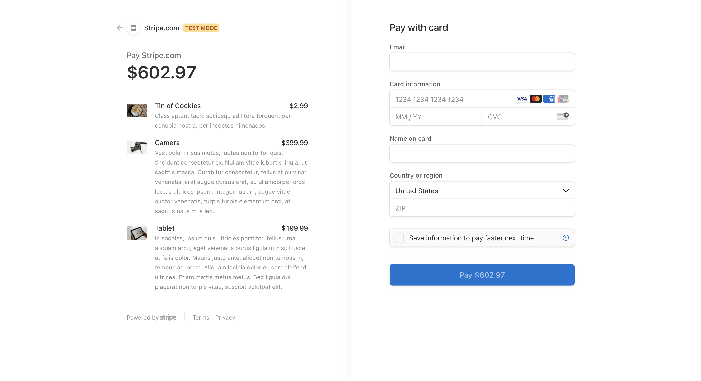

# hw22-redux-store

# 📋 Description 📋

Redux-Store is an application that allows user to purchase products online and checkout using a payment processing through Stripe. 

# 💼 Technologies Used 💼

* `Node.js`
* `npm (Node Package)`
* `Javascript`
* `React`
* `React Router`
* `CSS`
* `Stripe`
* `Graphql`
* `MongoDB`
* `Mongoose`
* `Express JS`
* `React-Redux`
* `Apollo-Express`

# 📸 Screenshots 📸

## Show the homepage

## Show items in the cart and required login to checkout

## Login page

## Checkout with stripe

# 🔗 Application Links

* [Github](https://thuluong249.github.io/redux-store-hw22/)
* [Heroku](https://redux-in-kent.herokuapp.com/)

# 📱 Contact 

* [Github](https://github.com/thuluong249)

* <a href="mailto:thujtn2019@gmmail.com">💌 Email</a> 

---